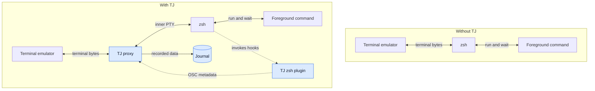
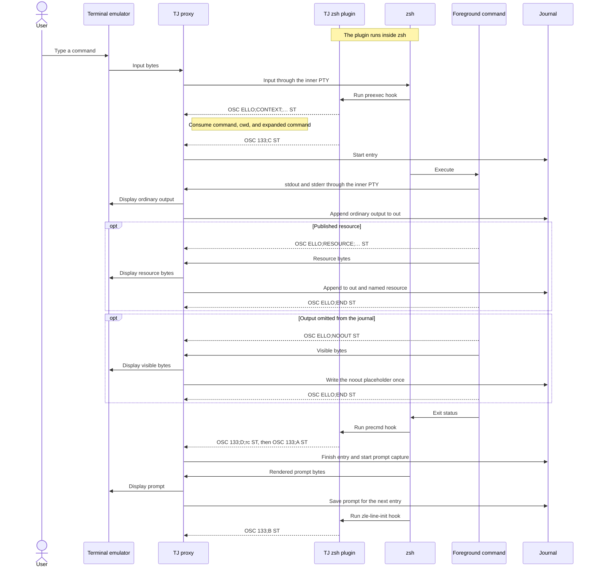

# Shell integration

`tjctl new/use` launches a PTY proxy. In an active direct TJ shell, use the
plugin's `tj-new/tj-use` helpers instead: they move the active proxy to another
journal without launching a nested proxy. The zsh plugin tells it when a command starts and ends and
provides the command, expanded command, prompt, and working directory. Without
the plugin, terminal bytes still pass through but shell entries are not
recorded.

## How recording works



TJ inserts the proxy into the existing terminal byte path. The plugin runs
inside zsh and adds metadata; the command still uses the terminal normally.
Blue nodes are TJ components.

The command lifecycle shows when those extra messages appear:



The terminal sends input to TJ, and TJ forwards it unchanged to the inner PTY.
Output travels in the opposite direction, which lets the proxy inspect it
before forwarding it to the terminal.

Solid arrows in the lifecycle are ordinary input, output, execution, or
journal writes. Dashed arrows are OSC metadata added by the plugin or a
cooperating command.

OSC ELLO messages are private instructions for TJ. The proxy consumes them, so
they do not appear on screen or in `out`. OSC 133 command-boundary messages are
observed by TJ and also forwarded to the terminal. Ordinary output remains
ordinary terminal data. The proxy also observes OSC 0 and OSC 2 title changes
so it can preserve the application's title while adding the recording marker.

## Load the plugin

Add one line to `~/.zshrc`:

```zsh
source /usr/local/share/tj/tj.plugin.zsh
```

For Homebrew:

```zsh
source "$(brew --prefix)/share/tj/tj.plugin.zsh"
```

The plugin preserves existing `accept-line`, completion, and dynamic named
directory handlers.

## TUI key binding

While a journal shell is at its prompt, Ctrl-X Ctrl-T opens `tj tui`. Closing
the TUI returns to the command line that was being edited. The two-key sequence
avoids the Ctrl-T binding commonly installed by fzf.

In an entry's detail view, Enter returns the focused line or selected lines.
When the browser was opened through the widget, that value is inserted at the
cursor in the current command line.

Set `TJ_TUI_KEY` before sourcing the plugin to choose another ZLE key sequence,
or set it to `none` to install the widget without binding a key:

```zsh
export TJ_TUI_KEY='^X^J'
source ~/.local/share/tj/tj.plugin.zsh
```

The widget is named `_tj_tui_widget`, so it can also be bound explicitly with
`bindkey`.

## Reference expansion

zsh dynamic named directories make `~[@42]` resolve to an entry directory.
The plugin also converts interactive shorthand at the start of unquoted words:

```text
@42/out                    -> ~[@42]/out
@-/out                     -> ~[@-]/out
@release-build.42/out      -> ~[@release-build.42]/out
```

zsh performs the filesystem expansion. The terminal and shell history show the
canonical `~[...]` form, while programs receive the full path. TJ preserves the
original shorthand in the entry's `cmd` resource.

## Completion

The installation provides command completion for forms such as:

```text
tj <Tab>
tj hist --<Tab>
tjctl replay --<Tab>
```

The plugin separately completes references:

```text
~[@<Tab>
~[@42]/<Tab>
@42/<Tab>
```

Resource completion includes core entry files, `files/`, and published
resources.

## Prompt variables

The writer exports these variables to its child:

| Variable | Value |
|---|---|
| `TJ_REF` | Qualified reference for the command about to be typed |
| `TJ_NEXT` | Next entry number |
| `TJ_JOURNAL` | Complete journal name |
| `TJ_TITLE` | Shell-evaluated title format, or `none` |
| `TJ_TITLE_BLINK` | Title blink interval in milliseconds |
| `TJ` | Path to the entry command, when discoverable |
| `TJCTL` | Path to the journal command, when discoverable |

They are unset outside a journal.

Plain zsh example:

```zsh
PROMPT='${TJ_NEXT:+~[@$TJ_NEXT] }%~ %# '
```

Starship example:

```toml
format = '$all${env_var.TJ_REF}$character'

[env_var.TJ_REF]
format = '[$env_value]($style) '
style = 'dimmed white'
```

## Terminal titles

At a prompt, the plugin evaluates `TJ_TITLE` using zsh prompt expansion. This
allows forms such as `%3~` for the last three components of the working
directory and variables such as `$TJ_REF`.

```sh
tjctl use project-work --title 'TJ | $TJ_REF | %3~'
```

While another foreground program runs, the plugin allows that program to set
the title. The proxy remembers OSC 0 and OSC 2 title changes and adds only the
alternating recording marker. It restores the most recent underlying title on
each update.

Use `--title none` to disable TJ title handling, or `--title-blink 0` to keep
the title format without the alternating marker.
